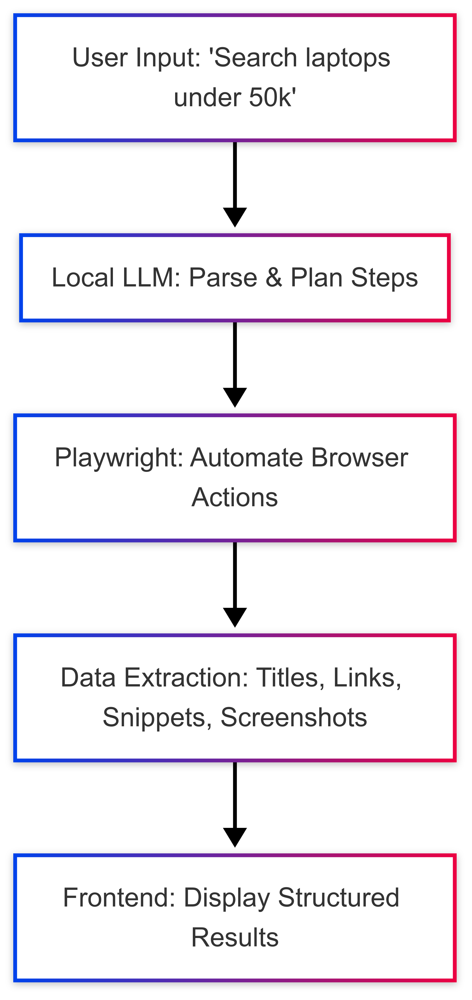

# 🌐 Web Navigator AI Agent

---

## 📌 Problem Statement
In the modern digital world, humans interact with hundreds of websites daily. Imagine an **intelligent assistant** that can autonomously browse, extract data, and perform web tasks — **without internet dependence on cloud LLMs**.  

The **Web Navigator AI Agent** achieves this by combining:  
- **Local LLM for instruction understanding**  
- **Browser automation for execution**  
- **Structured outputs for actionable insights**

---

## 💡 Proposal & Prototype Plan

We aim to build a **fully local AI agent** that takes natural language commands and performs web tasks autonomously.  

## 💡 Workflow

The following diagram shows how the **Web Navigator AI Agent** processes a user instruction:

📋 Prototype Phases

1. **Instruction Parsing:** Local LLaMA 3.2 7B interprets commands.  
2. **Browser Automation:** Playwright executes actions in headless or VM browser.  
3. **Task Execution:** Supports multi-step reasoning & error handling.  
4. **Output:** Structured JSON/CSV results, optional screenshots.  
5. **User Interaction:** React GUI + optional voice commands.

---

### ✅ Features in this workflow

| Feature              | Description                                | Status |
| -------------------- | ------------------------------------------ | ------ |
| Instruction Parsing  | Understands natural language via local LLM | ✅     |
| Browser Automation   | Search, click, form fill, scrape           | ✅     |
| Multi-step Reasoning | Execute chained commands intelligently     | ⚡      |
| Task Memory          | Remembers previous instructions            | ⚡      |
| Error Handling       | Retry and fallback strategies              | ⚡      |
| Structured Output    | JSON/CSV with optional screenshots         | ✅     |
| GUI Interface        | React web app for interaction              | ✅     |
| Voice Input          | Optional speech-to-command                 | ⚡      |

> ⚡ Means future implementation planned

**🛠️ Tech Stack**

frontend:
  framework: React + Vite
backend:
  language: Python
  framework: Flask
automation:
  library: Playwright
llm:
  model: Ollama LLaMA 3.2 7B
interface: REST API + Web UI
deployment: Local, no cloud dependency

| **Member**   | **Role**       | **Contribution**                                          |
| ------------ | -------------- | --------------------------------------------------------- |
| Rawhan Ramzi | Project Lead   | Defined vision, LLM orchestration, architecture & roadmap |
| Sumanth      | Backend Dev    | Flask API, Playwright integration, data extraction        |
| Harish       | Frontend Dev   | React UI, displaying structured results                   |
| Rajesh       | LLM Specialist | Configured and fine-tuned local LLaMA model               |

**📈 Vision**

The Web Navigator AI Agent is not just a prototype; it’s a next-generation personal web assistant. Future goals include:

Multi-agent collaboration

Adaptive learning from user behavior

Integrating local databases for enhanced memory

Cross-platform desktop version

**⚡ Getting Started**

# Backend
cd backend
python -m venv venv
source venv/bin/activate
pip install -r requirements.txt
python main.py

# Frontend
cd ../frontend
npm install
npm run dev
